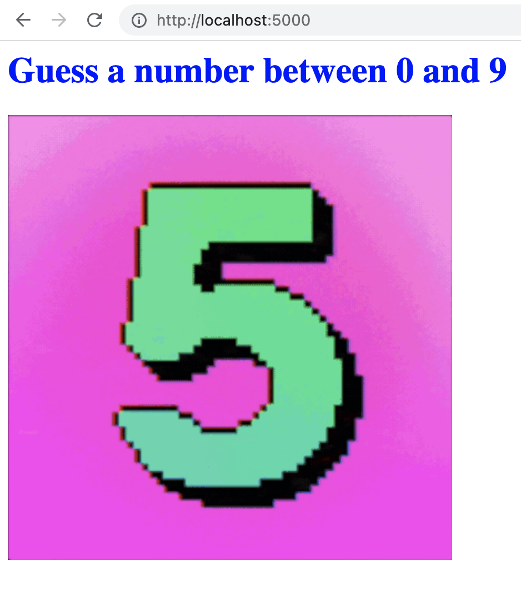

# Higher Lower Game - Python/Flask 

  ## Description

  Simple app where the user guesses a number between 0 and 9.

  Screenshot of app:
  

  ## Table of Contents
  
  - [Installation](#installation)
  - [Usage](#usage)
  - [License](#license)
  - [Contributing](#contributing)
  - [Tests](#tests)
  - [Questions](#questions)
  
  ## Installation
  
  run main.py from the command line
  
  ## Usage
  
  Go to http://localhost:5000 in your browser. You will be prompted to enter a number between 0 and 9. To guess,
  append your guess to the url (i.e. if your guess is 5, the url should be "http://localhost:5000/5"). 
  HTML rendered will indicate whether the guess is too high or too low, or if the guess is correct.  Continue 
  guessing until the right answer is achieved.

  ## License
This application is covered under the MIT License.
 For more information: https://opensource.org/licenses/MIT
  
  ## Contributing
  N/A
  
  ## Tests
  N/A

  ## Questions
  Contact Info 
  GitHub user name: BillStephens2022 
  Link to GitHub profile: https://github.com/BillStephens2022 
  Email: stephensbill17@gmail.com